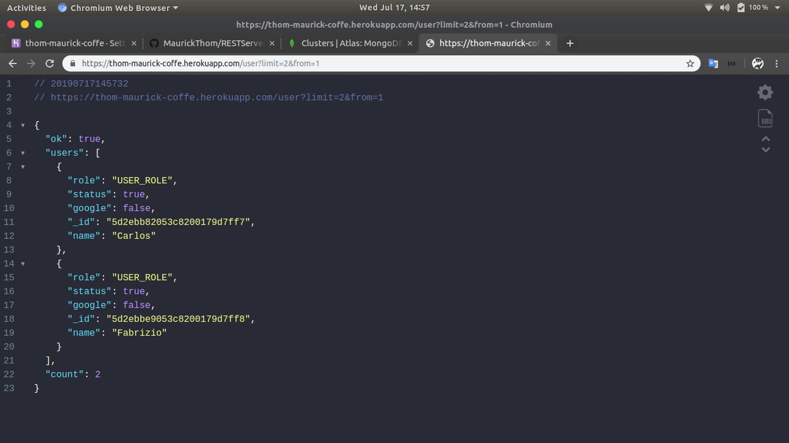
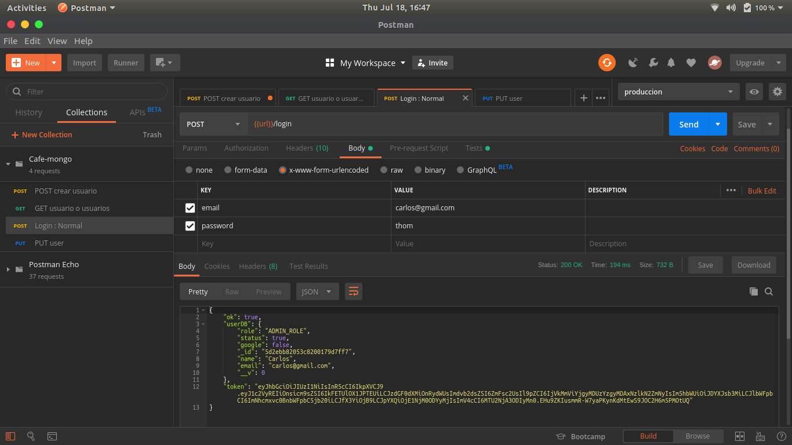

# **RESTServer**

````sh

    > npm install
    > npm start

````

## **Example**





## **Documentation**

- [***Development***](https://documenter.getpostman.com/view/6737859/SVSNJTBu?version=latest)
- [***Production***](#)
